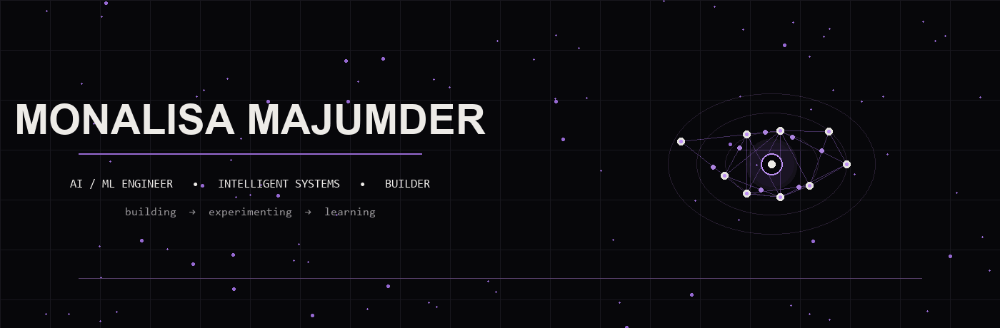

  

<h2>⚡ FEATURED PROJECT</h2>

<table>
<tr>

<td width="60%" valign="top">

<h2>🌐 5G NETWORK SLICING</h2>

<b>Machine Learning × 5G Networks × Time-Series Forecasting</b>

An end-to-end 5G network slicing project combining
real network experiments, synthetic data, and ML-based
network behaviour forecasting.

 

  

  

⚡ Real Network Experiments
 
◈ Synthetic Data Generation
 
◆ Time-Series Forecasting
 
✦ ML Model Comparison

 

</td>

<td width="40%" align="center">

<h3>◈ NETWORK → INTELLIGENCE</h3>

 

<b>5G CORE</b>

↓

🟣 <b>eMBB</b>
 
LSTM

🔵 <b>URLLC</b>
 
TimesFM

🟢 <b>mMTC</b>
 
PatchTST

↓

<h3>⚡ PREDICTION</h3>

</td>

</tr>
</table>

  

<h2>⚙ SKILLS</h2>

 

<h3>💻 PROGRAMMING</h3>

  

<h3>🌐 WEB</h3>

  

<h3>🧠 AI / ML</h3>

  

<h3>☁️ TOOLS & PLATFORMS</h3>

  

<code>PROGRAMMING</code>
&nbsp; • &nbsp;
<code>MACHINE LEARNING</code>
&nbsp; • &nbsp;
<code>CLOUD</code>
&nbsp; • &nbsp;
<code>DEVELOPMENT</code>

  

<h2>◈ GITHUB ACTIVITY</h2>

 

  

<b>Consistent commits. Continuous learning.</b>

More projects and experiments coming here...

 

<h2>🌐 CONNECT</h2>

 

Building • Learning • Experimenting

